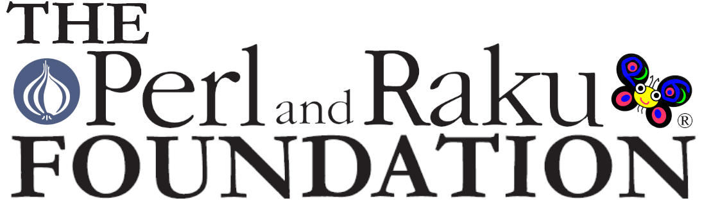

# Google Summer of Code ideas page for Perl and Raku projects

The Perl and Raku Foundation participates in
[Google Summer of Code](https://summerofcode.withgoogle.com/) 2023.
This page lists project ideas for Perl, Raku and its related projects.

## Project Ideas

Here's a list of project ideas proposed by the community:

- [Raku: MIR backend for MoarVM's Just In Time compiler](raku/mir-backend.md)

- [gRPC client for Raku](raku/gRPC.md)

- [Raku Inline::Python (3) update](raku/Inline::Python-Update.md)

- [Raku Add missing encodings to MoarVM](raku/missingencodings.md)

- [Raku Add native small integer support to MoarVM](raku/nibbles.md)

- [Raku Module Chain Introspection](raku/rakumods.md)

## How to participate

Each project lists the mentors with their contact information at the end.

We encourage you to get in contact with the mentors and the Perl / Raku community as early as
possible. Talking with the mentors about the projects you are interested in is the fastest way to
get a good understanding of the project. And that is the most important step for a good application
and successful project.

If you are a student and have a project idea not listed above, feel free to contact the organization
administrators and just ask!

## General information on the initiative

Google offers some very good documentation for Summer of Code. If you haven't already you should really
[head over to it](https://summerofcode.withgoogle.com/). Make sure you don't miss

- [How it works](https://summerofcode.withgoogle.com/how-it-works/)
- the [FAQ](https://developers.google.com/open-source/gsoc/faq)
- and the [Student Guide](https://google.github.io/gsocguides/student/)

## Contact the Raku community

In general the Raku community is most active on IRC. Just drop by on the
[#raku](https://web.libera.chat/#raku) Freenode channel and say Hello!

If you prefer email, head over to the [mailing lists](https://raku.org/community/).
The [perl6-users mailing list](https://www.nntp.perl.org/group/perl.perl6.users/) is the one you
probably want to use.

## Contact the Perl community

Here's a list of [Perl mailing lists](https://lists.perl.org/), with
[this Perl specific list for beginners](https://www.nntp.perl.org/group/perl.beginners/).
Perl has its own IRC hosting site, with [this list of channels](http://www.irc.perl.org/channels.html).
`#perl-help` is the best place for beginners.

## Contact the Orgainzation Administrators

- Patrick Böker <patrick.boeker@posteo.de>
- Makoto Nozaki <makoto@perlfoundation.org>

## Previous GSoC pages

- [GSoC 2019](https://perl-foundation-outreach.github.io/ideas)
- [GSoC 2020](https://perl-foundation-outreach.github.io/gsoc-2020-ideas)
- [GSoC 2021](https://perl-foundation-outreach.github.io/gsoc-2021-ideas)

## Mentors

We have a dedicated guide for people interested in mentoring a Perl or Raku project:
[Perlyglot Mentors Guide](mentors-guide.md).

